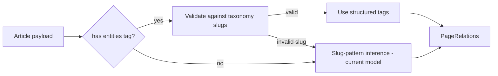

# Guide ↔ Landing Relations — Backend Contract & Frontend Rollout Plan

**Status:** Live on Traffic Engine (v2.2)
**Audience:** Backend (Traffic Engine / Content API) + Frontend
**Goal:** Replace slug-pattern guessing with explicit, structured relation tags on every article, while keeping the current slug-based model fully working as a fallback. **Zero breaking changes** — every new field is optional and additive.

---

## 1. Problem (current state)

Today the frontend infers which landing pages relate to a guide **purely from slug patterns**:

- `guides/{country}-ivf-guide` → country guide
- `guides/{country}-{city}-ivf-guide` / `guides/{country}/{city}-ivf-guide` → city guide
- Treatment is **hardcoded to `ivf`** everywhere (`hubs.ts`, `link-graph.ts`, `site-graph.ts`)

This breaks down because:

1. Non-IVF guides cannot be classified at all (`buildGuideArticleItem` returns `null` → dropped from lists).
2. City names derived from display text can diverge from taxonomy city slugs.
3. The nested→flat slug migration changes inference results.
4. Guides → landings linking (the reverse direction) has no data to work from.

## 2. What we are asking the backend to provide

### 2.1 The relation tag structure (per article)

Add an optional `entities` object (plus `pageType`) to the published-page payload of `GET /content/by-slug/{slug}` and `GET /content/{id}`. This matches the v2.2 schema the frontend already has defined (`ContentPageSchemaV22` in `frontend/src/lib/api/types.ts`):

```json
{
  "version": "2.2",
  "pageType": "guide",
  "entities": {
    "treatment": { "slug": "ivf", "name": "IVF" },
    "country":   { "slug": "spain", "name": "Spain" },
    "city":      { "slug": "barcelona", "name": "Barcelona" },
    "clinics": [
      { "slug": "instituto-bernabeu", "name": "Instituto Bernabeu", "urlPath": "/clinics/spain/alicante/instituto-bernabeu" }
    ]
  }
}
```

Field rules:

- `pageType`: one of `guide`, `guides_hub`, `country_landing`, `city_landing`, `treatment_landing`, `cost`, `compare`, `generic`. Optional; absence means "unknown" and the frontend falls back to slug inference.
- `entities.treatment` / `entities.country` / `entities.city`: **canonical taxonomy slugs** — they MUST match the slugs returned by `GET /catalog/taxonomy` exactly. This is the single most important requirement; the frontend builds all landing URLs (clinic PLPs, `/cost/...`, `/countries/...`) from these slugs.
- `entities.clinics`: optional, only when an article explicitly features specific clinics.
- All fields optional. A guide with only `country` set is valid. An article with no `entities` at all is valid (legacy behavior).

The frontend computes the landing URLs itself from these tags — the backend does **not** need to send `urlPath`s for landings (only for `clinics`, where the path is non-derivable). This avoids URL-drift between the two systems.

### 2.2 Expose tags in the list endpoint (required for landing → guide direction)

`GET /content/pages` items today are `{ id, slug, language, updatedAt }`. To place "related guides" sections on landing pages without N per-slug fetches, extend each list item with the same optional fields:

```json
{
  "id": 123,
  "slug": "guides/spain-barcelona-ivf-guide",
  "language": "en",
  "updatedAt": "2026-06-01T00:00:00Z",
  "pageType": "guide",
  "title": "IVF in Barcelona: Complete Patient Guide",
  "entities": {
    "treatment": { "slug": "ivf", "name": "IVF" },
    "country":   { "slug": "spain", "name": "Spain" },
    "city":      { "slug": "barcelona", "name": "Barcelona" }
  }
}
```

- `title` (SEO title) included so listing cards don't need slug-derived titles.
- Optional but strongly preferred. If omitted, the frontend keeps its current behavior (slug heuristics + per-slug summary fetches).

Optionally, support a filter so landings can query directly:

```
GET /content/pages?pageType=guide&country=spain
GET /content/pages?pageType=guide&country=spain&city=barcelona
GET /content/pages?pageType=guide&treatment=ivf
```

Unknown query params must be ignored by older backend versions (they already are), so this is additive too.

### 2.3 Backward-compatibility requirements (hard constraints)

1. **No existing field changes shape, name, or nullability.** `entities`, `pageType`, `title` (on list items) are new optional keys only.
2. **`version` stays a string**; bump to `"2.2"` only on payloads that actually carry the new fields. Frontend accepts both `"2.1"` and `"2.2"`.
3. **Slugs and URLs do not change** as part of this work. The flat-guide-slug migration is a separate track.
4. Articles published before backfill simply have no `entities` — that is a supported permanent state, not an error.

### 2.4 Backfill guidance (backend, non-blocking)

- Seed `entities` for existing guides from the same slug patterns the frontend uses today (`{country}-ivf-guide`, `{country}-{city}-ivf-guide`), validated against taxonomy slugs. Anything that doesn't validate stays untagged rather than mis-tagged.
- New articles created in the CMS should require the tags at authoring time (treatment + country at minimum for guides).

---

## 3. Frontend plan: tags-first resolution with slug fallback

### 3.1 Single resolver, two sources

Create one resolver that all relation logic goes through — `resolvePageRelations` in `frontend/src/lib/content/link-graph.ts` (or a new `relations.ts`):

```
Input:  ContentPage | ContentListItem (+ taxonomy)
Output: normalized PageRelations { pageType?, treatment?, country?, city?, clinics[] }

Order:
  1. If payload has `entities` → validate slugs against taxonomy → use them.   (NEW, preferred)
  2. Else → parseEntitiesFromSlug / parseGuideSlug (current model, unchanged). (FALLBACK)
```

Resolution flow:



Key rule: **the slug-based model is not modified or removed.** It stays exactly as-is (`parseEntitiesFromSlug`, `partitionGuides`, `parseCitySlug`, `isCountryGuideSlug`, etc.) and remains the only path for untagged content — so nothing currently working can regress ("تو دیوار نمی‌ره").

### 3.2 Frontend changes (ordered)

1. **Schema**: switch `loadPublishedPage` to parse with `ContentPageSchemaV22` (already defined; all new fields optional → old payloads still validate). Extend `ContentListItemSchema` with optional `pageType`, `title`, `entities`.
2. **Resolver**: implement `resolvePageRelations` with the order above; add unit-style validation against taxonomy (invalid tag → fall back to slug inference, log a warning).
3. **Consumers migrate to the resolver** (no behavior change for untagged content):
   - `buildRelatedLandingsForEntities` / `findRelatedGuides` (clinic PLPs, PDP, cost pages)
   - `buildGuideArticleItem` / `buildGuideGroups` (guides hub, nav, country/treatment landings) — tagged non-IVF or non-place guides stop being dropped
   - `GuideDimensions` in `site-graph.ts` (treatment comes from tag when present instead of hardcoded `'ivf'`)
4. **Guide → landing rendering** (uses the resolver output): related-landings block + `CrossHubNav` on guide articles, guide links on cost country/city and compare pages — covered in the main UI plan (`ui_polish_and_guide_linking` plan, Part 4).
5. **List-endpoint adoption**: when `entities` appears on list items, `loadGuideSummaries`'s per-slug fetch loop for titles becomes unnecessary for tagged items — keep the loop only for untagged ones.

### 3.3 Acceptance criteria

- With backend unchanged (no `entities` anywhere): site behavior is byte-for-byte identical to today.
- With one tagged guide: that guide appears in related sections via its tags even if its slug matches no pattern (e.g. a future `guides/dental-veneers-turkey` works with `treatment: dental-veneers`).
- A tagged guide with a slug-pattern conflict (tag says `portugal`, slug says `spain`) follows the **tag**.
- A tag with an invalid taxonomy slug falls back to slug inference and does not crash or 404.

---

## 4. Rollout order

1. Frontend ships resolver + V22 parsing first (safe with current backend — pure fallback path).
2. Backend adds `entities`/`pageType` to by-slug payloads, then to list items, then backfills guides.
3. Frontend removes per-slug title fetching for tagged items (perf win), keeps fallback forever for legacy/untagged content.
